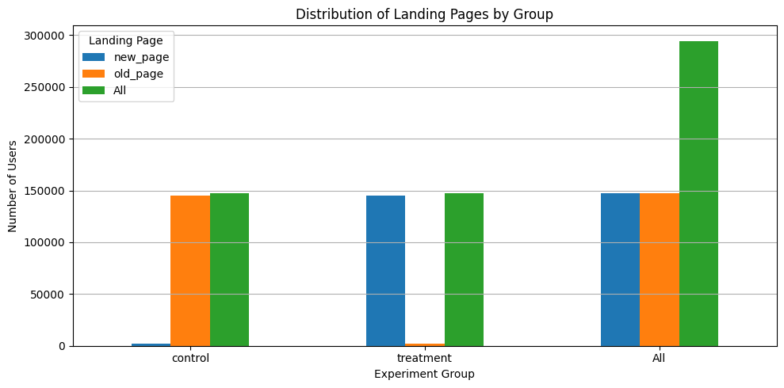
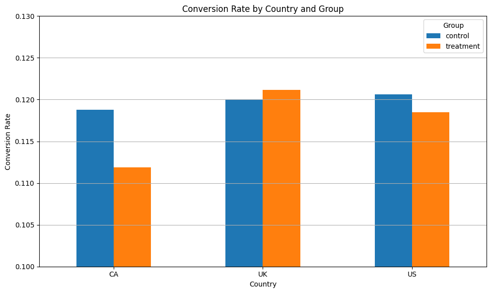

# Ecommerce A/B Testing
Analyzing an A/B Test for an E-commerce Checkout Redesign

## Project Purpose and Goals
The goal of this A/B test is to evaluate whether a redesigned e-commerce checkout page improves the **conversion rate** compared to the current version. Users are randomly assigned to either the control group (existing page) or the treatment group (new design), and their behavior is analyzed using appropriate statistical methods. The purpose is to make a **data-driven decision** on whether to roll out the new design to all users based on clear statistical evidence.

**Primary Objective:**
> Test the hypothesis that the redesigned checkout page leads to a significantly higher conversion rate.


## Dataset Source and Description
### Datasets Used:
1. `ab_test.csv`
    - Contains user-level data including:
        - `user_id`: Unique user identifier
        - `group`: A/B test group assignment (control/treatment)
        - `landing_page`: Old or New version of the checkout page
        - `converted`: Whether the user converted (1) or not (0)
    - Size: ~294,478 records before cleaning.

2. `countries_ab.csv`
    - Contains country information mapped to `user_id`


## Tools and Libraries Used
| Tool / Library     | Purpose                            |
|--------------------|------------------------------------|
| `pandas`           | Data wrangling and transformation  |
| `matplotlib.pyplot`| Visualization                      |
| `seaborn`          | Enhanced visual styling            |
| `scipy.stats`      | Z-test for proportions             |
| `numpy`            | Array and mathematical operations  |


## How to Run the Code
1. Place `ab_test.csv` and `countries_ab.csv` in a `Data/` directory.
2. Install required packages (if not already installed):
```bash
pip install -r Requirements.txt
```
3. Run the Python script or notebook line-by-line.

### Main steps in the code:
   - Load and clean the datasets
   - Validate experimental groups and page assignments
   - Merge in country data
   - Compute conversion rates
   - Perform overall and country-level Z-tests
   - Visualize results
   - Summarize findings and recommendations


## Summary of Results
### Overall A/B Test Results
| Group     | Conversion Rate |
|-----------|------------------|
| Control   | 12.04% (0.12039) |
| Treatment | 11.89% (0.11892) |

**Z-Test Result:**
- Z-Score: 1.31
- p-Value: 0.189
> **Conclusion:** No statistically significant improvement from the new page.

Refer [Executive Summary](Executive_Summary.pdf)


## Data Cleaning & Validation
### Issues Found:
- **3,893** rows (≈1.32%) where group assignment didn't match the landing page.
- **1** duplicate `user_id`.

### Cleaning Steps:
- Removed mismatched rows: Control group should only see `old_page`, and Treatment group should only see `new_page`.
- Dropped duplicate users, keeping only the first occurrence.

**Final Cleaned Dataset Size:** `290,585` rows


## Experiment Design
This analysis uses a **two-proportion Z-test** to statistically compare the conversion rates of the control and treatment groups.

### Goal:
Determine whether the redesigned checkout page significantly increases the proportion of users who convert.

### Why Z-Test for Proportions?
A Z-test for two proportions is the appropriate test here due to the following reasons:
- **Binary Outcome**: Our outcome is categorical (converted or not), which makes this a test of proportions — not means.
- **Two Independent Groups**: The control and treatment groups are randomly assigned, ensuring independence.
- **Large Sample Size**: Both groups have >10 successes and failures, satisfying the assumptions for normal approximation under the **Central Limit Theorem (CLT)**.
- **Pooled Standard Error**: The Z-test uses a pooled estimate of the conversion rate under the null hypothesis to calculate the standard error.

### Z-Test Formula:
Let:
- $n_1$ : number of users in control group
- $n_2$ : number of users in treatment group
- $x_1$ : number of conversions in control group
- $x_2$ : number of conversions in treatment group

Then compute:
- $p_1 = x_1/n_1$ : conversion rate for control group
- $p_2 = x_2/n_2$ : conversion rate for treatment groups
- $p_{pool} = (x_1 + x_2)/(n_1 + n_2)$ : pooled proportion
- Standard error (SE):
$$ SE = \sqrt{p_{pool} \left(1-p_{pool} \right) \left(\frac{1}{n_1} + \frac{1}{n_2} \right)} $$

Then the Z-score is:
$$ Z = \frac{p_1 - p_2}{SE} $$

The Z-score is then compared to the standard normal distribution to obtain a **p-value**.

### Why Not Other Tests?
- **t-test**:
    - Designed to compare **means** of continuous numeric variables (e.g., average time on page) not proportions.
    - It assumes **normally distributed data**, which binary variables like "converted (yes/no)" do not satisfy.
    - Using a t-test here would violate assumptions and produce misleading results.

- **Chi-squared Test**:
    - Appropriate for testing **general independence** between two categorical variables in a contingency table.
    - It tells us **whether there's an association**, but not the **direction or magnitude** of the difference in proportions.
    - Less precise and less interpretable than a Z-test for two-group comparisons.

- **Fisher’s Exact Test**:
    - Ideal for **small sample sizes** or when expected counts are low.
    - Computationally **inefficient for large datasets** and unnecessary here.

#### Summary Table
| Test                 | Best For                         | Why Not Suitable Here                  |
|----------------------|----------------------------------|----------------------------------------|
| **Z-Test**           | Two proportions (binary outcome) | ✅ Most appropriate choice             |
| **t-Test**           | Comparing means (continuous)     | ❌ Not for binary data                 |
| **Chi-squared Test** | Multiple categorical groups      | ❌ Doesn't quantify difference direction|
| **Fisher’s Exact**   | Small sample, categorical data   | ❌ Inefficient for large N             |

### Assumptions Verified:
- Random assignment to groups
- Independent observations
- Binary outcome
- Large enough sample for normal approximation

> Therefore, the two-proportion Z-test is statistically sound and justified for evaluating the effect of the new checkout page.


## Hypotheses
Let:
- $p_c$ : conversion rate for control
- $p_t$ : conversion rate for treatment

### Null Hypothesis $(H_0)$:
$H_0$ : $p_c = p_t$ — There is no difference in conversion rates

### Alternative Hypothesis $(H_1)$:
$H_1$ : $p_c \neq p_t$ — There **is** a difference in conversion rates

if **p-value $<$ 0.05**, reject $H_0$: there's a significant difference  
if **p-value $\geq$ 0.05**, fail to reject $H_0$: no significant difference


## Overall Z-Test for Proportions
### Conversion Rates:
| Group     | Converted | Total   | Conversion Rate |
|-----------|-----------|---------|------------------|
| Control   | 3,041     | 25,274  | 12.04%           |
| Treatment | 3,196     | 26,066  | 11.89%           |

### Z-Test Results:
- **Z-Score:** 1.3109
- **p-Value:** 0.189

### Interpretation:
Since p-value = 0.189 > 0.05, the null hypothesis **is not rejected**.
> The new checkout page does not result in a statistically significant improvement in conversions.


## Country-Based Insights
We merged country information and conducted the same test per country.
| Country | Control CR | Treatment CR | Z-Score | p-Value |
|---------|------------|--------------|---------|---------|
| US      | 12.06%     | 11.85%       | 1.51    | 0.132   |
| CA      | 11.88%     | 11.19%       | 1.30    | 0.195   |
| UK      | 12.00%     | 12.12%       | -0.47   | 0.635   |

> None of the differences were statistically significant at the 5% level in any country.


## Visualizations
1. Distribution of Landing Pages by Group

2. Conversion Rate by Country and Group

3. Difference in Conversion Rate (Treatment - Control)


## Conclusion
- There is **no significant evidence** that the redesigned checkout page improves conversion rate — **overall or by country**.
- The differences between treatment and control are small and likely due to chance.


## Recommendations
Based on the statistical analysis and business context, here are the key recommendations:
1. **Do Not Roll Out** the new checkout page at this time, as no statistically significant improvement was observed in conversion rates.
2. **Investigate Design Elements**: Consider A/B testing individual elements (e.g., button text, layout changes) rather than a full redesign.
3. **Enhance UX Research**: Gather qualitative feedback from users who dropped off during checkout to guide future iterations.
4. **Explore Targeted Rollouts**: If desired, experiment with the new page on specific segments (e.g., mobile users or returning visitors).


## Next Steps
1. **User Feedback**: Collect qualitative data (e.g., user surveys or session recordings) to understand user reactions to the new page.
2. **Segmented Analysis**: Evaluate performance by browser, device type, or traffic source.
3. **Multivariate Testing**: Isolate design changes rather than testing a complete redesign.
4. **Session Replay Analysis**: Use tools like Hotjar to observe behavior flow.


## Final Thoughts
This project showcases a complete A/B testing workflow from data cleaning and hypothesis testing to visualization and insight generation. Statistical rigor, domain knowledge, and practical interpretation are key to making informed decisions.
<br>
<br>

---

**Authored by:** *Janith Perera*  
**Tools:** Python, pandas, statsmodels, matplotlib